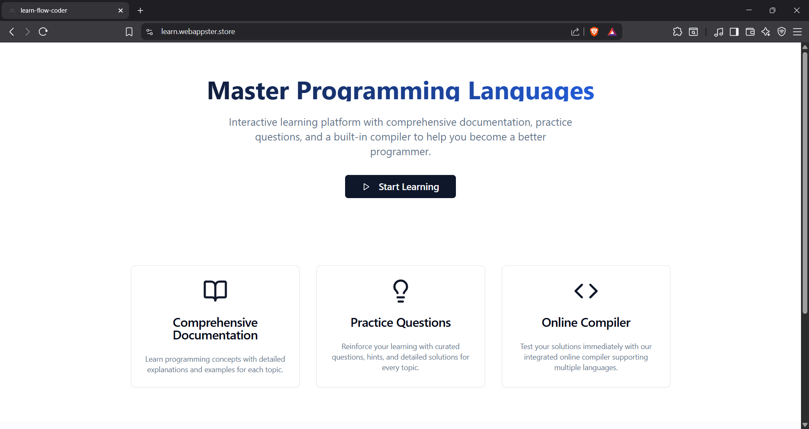
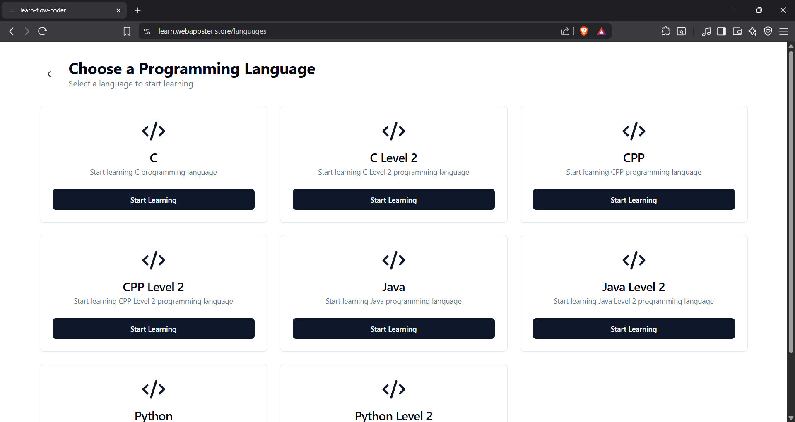
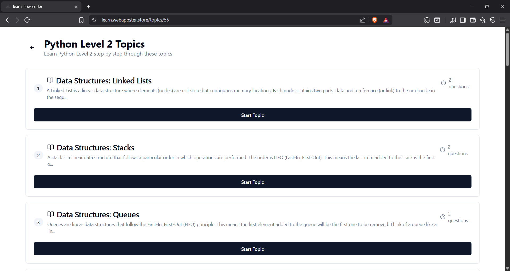
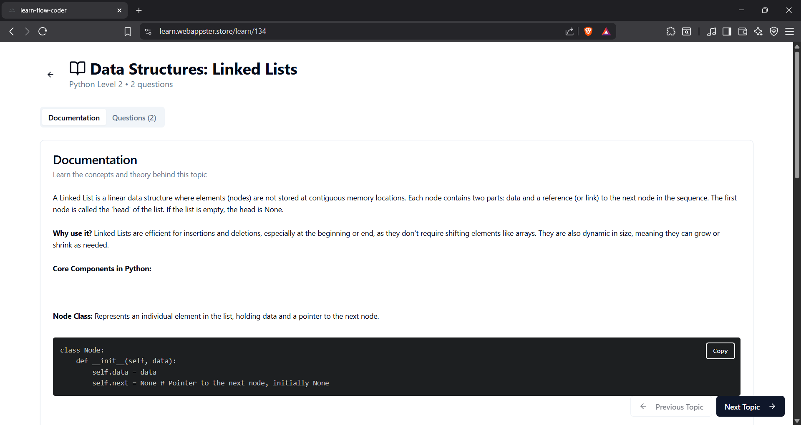
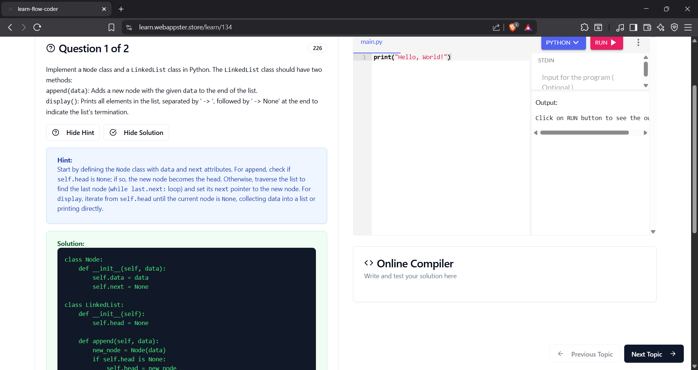

# Learn Flow Coder

A personal development repository focused on improving programming skills through structured coding practice and project-based learning.

This project is designed as a learning environment where different programming concepts, algorithms, and development workflows are explored through hands-on coding.

---

## Purpose

The goal of this repository is to build a structured learning flow for becoming a stronger developer by:

- Practicing programming concepts
- Implementing algorithms and problem-solving techniques
- Experimenting with development workflows
- Building small coding experiments and utilities

---

## Features

- Hands-on coding practice
- Algorithm and problem-solving exercises
- Experimentation with programming concepts
- Clean and structured learning workflow
- Continuous improvement through coding

---

## Technologies Used

Depending on the modules or experiments inside the repository:

- Python
- C++
- JavaScript
- Git & GitHub

---

## Learning Focus

This repository focuses on improving skills in:

- Data structures
- Algorithms
- Logical problem solving
- Code organization
- Developer workflow
- Writing clean and maintainable code

---

## Project Structure
learn-flow-coder/

├── algorithms/<br>
├── practice-problems/<br>
├── experiments/<br>
├── notes/<br>
└── README.md<br>


Each directory contains code and experiments related to specific learning topics.

---

## Screenshots

- Main page
  


- Courses
  


- Topics
  


- Documentation
  


- Questions
  


---

## How to Use

Clone the repository:

```bash
git clone https://github.com/SahilSidhu7/learn-flow-coder.git
```

Navigate to the project:
```bash
cd learn-flow-coder
```

Explore the directories and run the scripts or examples depending on the programming language used.

## Goals

- Improve coding fluency

- Strengthen algorithmic thinking

- Build consistent coding habits

- Document learning progress

## Future Improvements

- Add more structured coding challenges

- Implement data structure visualizations

- Add documentation for each learning module

- Track progress through coding milestones

## Author

Sahilpreet Singh Sidhu

GitHub:
https://github.com/SahilSidhu7

License

This project is open-source and available for learning and educational purposes.
